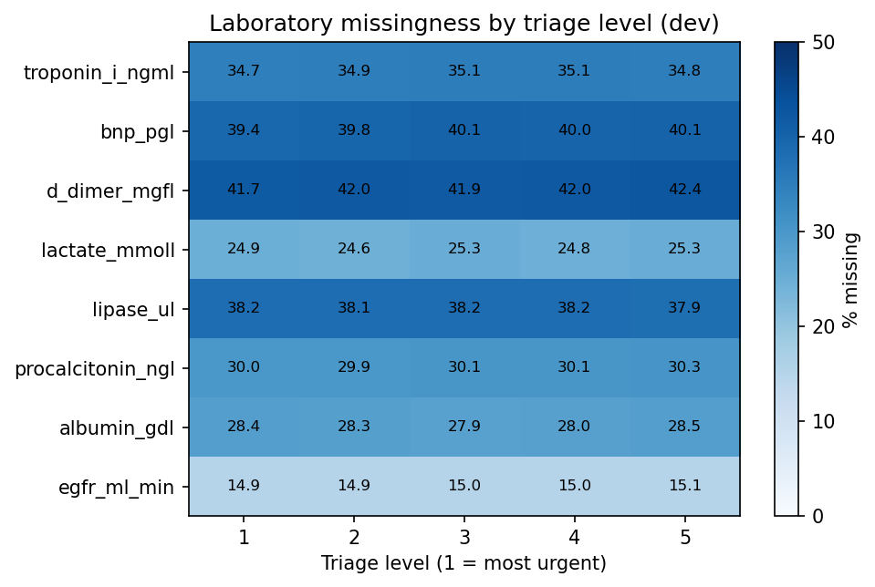
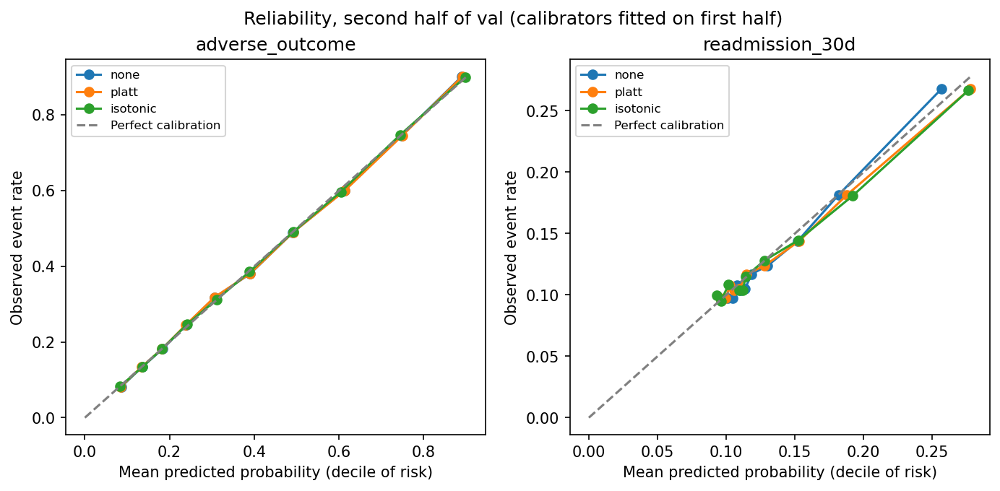
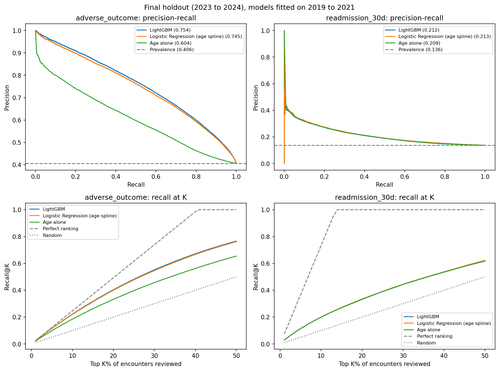
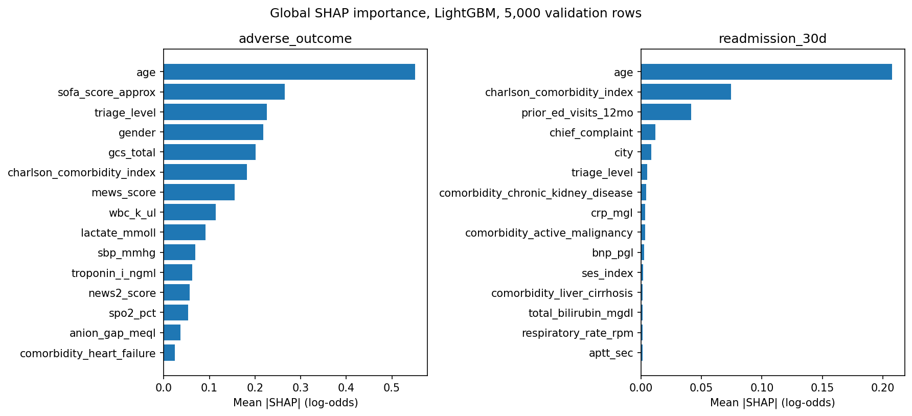
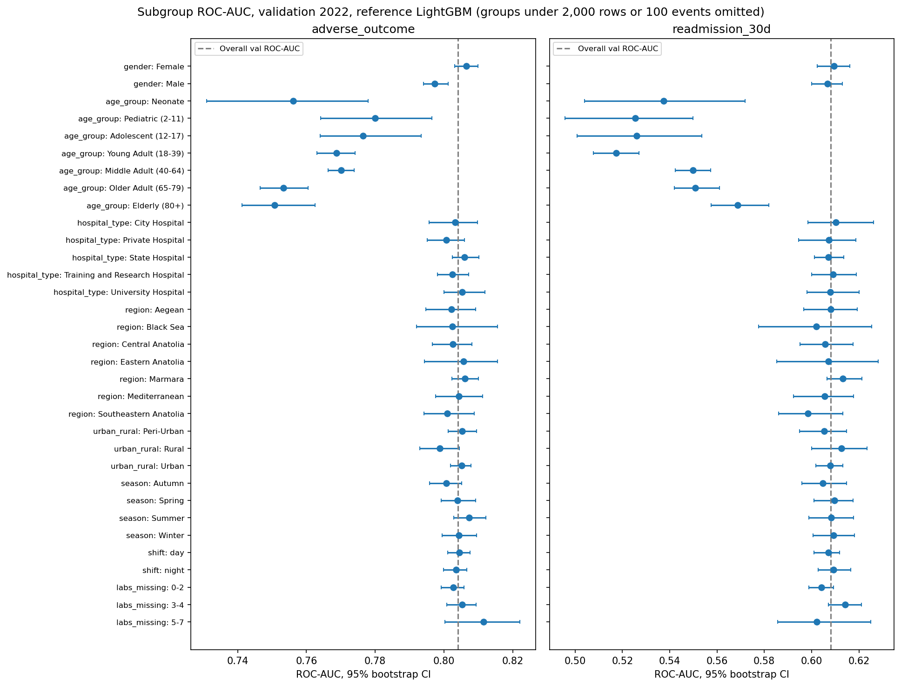
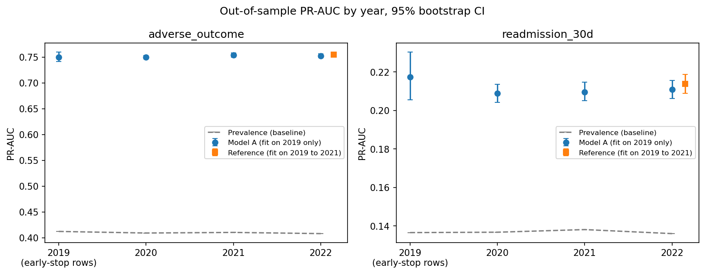

# Hospital Emergency Department Operational Risk Intelligence

A portfolio data-science project. It tests how well we can rank emergency-department (ED) visits by risk, using the AI-EMT synthetic benchmark from Kaggle. It predicts two things: a serious "adverse outcome" and a "30-day return" to the ED.

**Scope:** This is a notebook-based research project on synthetic data. It is not a hospital system and not a clinical tool. It has no API, deployment, monitoring, streaming or cloud setup.

> **Important.** The data are synthetic, which means computer-generated. Nothing in this project says anything about real patients, real hospitals or the NHS. Do not use any result here for diagnosis, triage or treatment.

## Project outcome

The selected model is **LightGBM**, a tree-based model, for both targets. It was chosen using 2022 validation data. It was then tested once on 2023 to 2024 holdout data (265,782 visits) that stayed locked until the end.

| Final holdout result | adverse_outcome | readmission_30d |
|---|---:|---:|
| Share of visits with the outcome | 40.6% | 13.6% |
| PR-AUC (95% interval) | 0.7540 (0.7515 to 0.7568) | 0.2122 (0.2084 to 0.2154) |
| PR-AUC from random guessing | 0.4060 | 0.1363 |
| PR-AUC from age alone | 0.6040 | 0.2093 |
| ROC-AUC | 0.8036 | 0.6069 |
| Brier score (a constant guess gives 0.2412 and 0.1177) | 0.1739 | 0.1148 |

What happens if staff can only review the highest-ranked visits:

| Review example (holdout) | adverse_outcome, top 20% | readmission_30d, top 10% |
|---|---:|---:|
| Visits reviewed | 53,156 | 26,578 |
| Visits with the outcome (all holdout) | 107,920 | 36,216 |
| Outcome visits found | 43,543 | 7,254 |
| Share of all outcome visits found (recall) | 40.35% | 20.03% |
| Share of reviewed visits that had the outcome (precision) | 81.92% | 27.29% |
| Reviewed visits without the outcome | 9,613 | 19,324 |
| Precision from picking at random | 40.6% | 13.6% |

In simple words:

- For **adverse_outcome**, the model ranks visits well. About 82 of every 100 reviewed visits had the outcome, against about 41 for a random pick.
- For **readmission_30d**, the model is only slightly better than using age alone (0.2122 against 0.2093). In this dataset, this target is mostly an age ranking.
- A neural network (MLP) and a transformer model (TabTransformer) were tested and **rejected**. They did not beat LightGBM.
- Kaggle says seven lab tests have "informative missingness". We found **no evidence** of that.
- We did not build the planned operational-pressure index. The data do not support it.

These are results on synthetic data. They are not hospital forecasts.

## Plain-language guide

| Term | Meaning |
|---|---|
| Synthetic data | Data made by a computer program, not collected from real people |
| Data leakage | Using information the model could not have known when it made the prediction |
| Chronological split | Train on the past and test on the future, so the test is realistic |
| Class imbalance | One outcome is much rarer than the other |
| PR-AUC | A score from 0 to 1 for how well a model finds true cases without too many false alarms. Random guessing scores the same as the share of true cases. Higher is better |
| ROC-AUC | A score from 0.5 (random) to 1 (perfect) for how well a model puts true cases above other cases |
| Recall@K, Precision@K | If you review the top K% of ranked visits: recall is the share of all true cases you found, and precision is the share of reviewed visits that were true cases |
| Calibration | When a model says "30%", about 30 of 100 such visits really have the outcome |
| Brier score | The average squared error of predicted probabilities. Lower is better |
| ECE | Expected Calibration Error. The average gap between predicted chance and the real rate. Lower is better |
| Bootstrap interval | We repeat a calculation on many resampled copies of the data. The range shows how much the number can move by luck |
| SHAP | A method that shows how much each input pushed one prediction up or down |
| MNAR | "Missing not at random". Whether a value is missing depends on the value itself or on something hidden |

## Questions this project answers

1. If a team can only review some visits, which visits should come first?
2. Do boosted trees or neural networks beat a simple Logistic Regression?
3. Does a missing lab test tell us anything about the outcome?
4. Does the model keep working across years, regions and patient groups?
5. Are the predicted probabilities honest, and which inputs drive them?

## Dataset

AI in Emergency Medicine - Turkiye (AI-EMT), Kaggle competition data, downloaded on 2026-10-01. Source: [add Kaggle URL]. Licence: [add the exact licence wording from the Kaggle page]. The dataset is **not** included in this repository.

| File | Rows | Columns | Use in this project |
|---|---:|---:|---|
| train.csv | 700,000 | 135 | Labelled data |
| supplemental_data.csv | 100,000 | 135 | Labelled data with the same columns, merged with train |
| hospital_reference.csv | 25 | 15 | City information, used for exploration only |
| icd10_reference.csv | 21 | 6 | Not used as features (it depends on the final diagnosis) |
| test.csv, sample_submission.csv | 200,000 | 132 | Not used, because they have no labels |

The merged labelled data have 800,000 visits from 25 cities, from January 2019 to December 2024. The last visit is on 2024-12-30. The column `nuts2_region` has 7 values (large geographic regions), not NUTS-2 regions as the Kaggle page says. There is no hospital ID, so the smallest place unit is the city.

## Targets

- `adverse_outcome` and `readmission_30d` are yes/no labels that come with the data. Kaggle gives no formal definition of either.
- The project plan said adverse_outcome means ICU admission or death. **The labels do not match that.** In train.csv, only 49.8% of "Admitted to ICU" visits and 45.9% of "Died in ED" visits have adverse_outcome = 1. Also, 12.1% of "Died in ED" visits have readmission_30d = 1.
- So the labels are used as given, and we make no claim about what they mean clinically.
- Share of visits with the outcome: adverse_outcome 0.4093 (development), 0.4080 (validation), 0.4060 (holdout). readmission_30d 0.1377, 0.1360, 0.1363. Both are flat across years.
- adverse_outcome is not rare. Its PR-AUC baseline is about 0.41, not near zero.

## Where the data differed from the original plan

| The plan or the Kaggle page said | The data showed |
|---|---|
| hospital_reference has 13 columns and icd10_reference has 7 | 15 and 6 |
| adverse_outcome means ICU admission or death | The labels do not match this |
| adverse_outcome is a rare event | It happens in 40.6% to 40.9% of visits |
| `nuts2_region` holds NUTS-2 regions | It holds 7 large geographic regions |
| Seven labs have informative (MNAR) missingness | No evidence of this in any test we ran |
| `disposition` is a direct proxy for both targets | The link is weak. It stays excluded as a post-visit column |
| 2020 and 2021 show structured distribution shift | None visible in the allowed features or in model scores |
| Institution-level analysis is possible | No hospital ID exists, so only city and region are possible |
| A deep model may add value | Both deep models were rejected |
| An operational-pressure index can be built | The data do not support it, so it was omitted |

## Methodology

### Leakage-safe evaluation

The prediction point is the **end of the first ED assessment**. Allowed inputs: triage, first vital signs, patient history and first-line lab tests. Lab results arrive after the first doctor review, so a no-labs test measures how much the models depend on them.

| Split | Years | Visits |
|---|---|---:|
| Development (training) | 2019 to 2021 | 400,365 |
| Validation | 2022 | 133,853 |
| Final holdout | 2023 to 2024 | 265,782 |

- There is no random split. All choices (features, settings, calibration, cut-offs) used development and validation data only.
- Holdout labels were removed from the model-ready file in Notebook 02. They were loaded for the first time in the evaluation cell of Notebook 09. That cell ran once.
- 24 columns that exist only after the visit started were excluded. Examples: all `proc_*` columns, `consult_*` columns, `ed_los_minutes`, `primary_icd10_code`, `primary_diagnosis` and `disposition`.
- `arrival_year`, `pandemic_period` and `covid_period_flag` are used only to describe time periods. They are not model inputs.
- `arrival_day`, `arrival_month` and `arrival_day_of_week` were dropped. Together they identify the calendar date, so a model can tell years apart (AUC 0.99). Month and weekday also carry no signal about the targets.
- Columns that repeat other columns were dropped (for example `triage_label`, `age_group`, `latitude`, `map_mmhg`). The final model uses **90 features**: 53 numeric, 30 yes/no and 7 category columns.
- A test that tries to tell development data from validation data gives AUC 0.500, so the input data look the same in both periods.

### Missing values

Seven lab columns have 25% to 42% missing values: d_dimer 41.98%, bnp 40.02%, lipase 38.17%, troponin_i 34.96%, procalcitonin 30.09%, albumin 27.99% and lactate 24.91%. `egfr_ml_min` is missing in 14.98% of visits. Kaggle calls the seven labs MNAR. We tested this on development data:

- Missing rates are flat across triage level, outcome, year, age group, gender, hospital type and the 30 chief complaints.
- A model that tries to predict each "is missing" flag from all other allowed inputs scores AUC 0.496 to 0.503. That is the same as a coin flip.
- Two of 16 outcome comparisons had p below 0.05, in opposite directions. Neither passes a Bonferroni limit of 0.003, and every gap is under half a percentage point.
- Adding "is missing" indicators changed validation PR-AUC by at most 0.0005. Median filling, filling plus indicators, and the native missing-value handling of tree models all gave the same result.

True MNAR depends on the missing value itself, and nobody can test that from the observed data. The conclusion covers only what we tested.



### Models

`Constant baseline -> Logistic Regression -> XGBoost -> LightGBM -> TensorFlow MLP -> TensorFlow TabTransformer`

| Model | Setup |
|---|---|
| Constant baseline | Predicts the development outcome rate for every visit |
| Age alone | Uses age as the score (extra reference) |
| Logistic Regression | Age spline, median filling, C = 0.1, no class weights |
| XGBoost | Native missing values, learning rate 0.05, depth 6, early stopping on validation PR-AUC (185 and 36 trees) |
| LightGBM | Native missing values, learning rate 0.05, 31 leaves, early stopping on validation PR-AUC (291 and 51 trees). Selected model |
| TensorFlow MLP | Embeddings for the 7 category columns plus dense layers. 4 settings, then 3 seeds of the best one |
| TensorFlow TabTransformer | Self-attention over category tokens plus a numeric branch. 3 settings, one skipped for readmission_30d, seed 0 only |

### Class imbalance

We tested three class weights (none, square root of the class ratio, full ratio). Weights gave no gain in PR-AUC for any model (changes of at most 0.0004 for adverse_outcome). They made the probabilities worse: Logistic Regression ECE on readmission_30d went from 0.0029 to 0.3491 at full weight. Final models use no weights. SMOTE (a method that creates synthetic training rows) was not run. Table: `reports/tables/imbalance_comparison.csv`.

### Calibration

Calibration was tested on 2022 validation data. We cut 2022 in time order. Platt scaling and isotonic regression were fitted on January to 2 July, then scored on 2 July to December. A calibrator was allowed only if it improved the Brier score by at least 0.0005. None did, so **no calibrator was used**. Unweighted LightGBM was already well calibrated.

| adverse_outcome, validation second half | Brier | ECE | PR-AUC |
|---|---:|---:|---:|
| No calibration | 0.17371 | 0.0055 | 0.7563 |
| Platt scaling | 0.17372 | 0.0054 | 0.7563 |
| Isotonic regression | 0.17372 | 0.0029 | 0.7506 |

| readmission_30d, validation second half | Brier | ECE | PR-AUC |
|---|---:|---:|---:|
| No calibration | 0.11366 | 0.0061 | 0.2101 |
| Platt scaling | 0.11365 | 0.0037 | 0.2101 |
| Isotonic regression | 0.11368 | 0.0039 | 0.2044 |

Isotonic regression lowers ECE but squeezes the scores into only 205 and 83 different values. That loses about 0.006 PR-AUC. ECE uses 10 equal-width bins. For readmission_30d almost all scores are low, so Brier is the better measure there.



### Review-capacity ranking

The model ranks visits by risk. The review policy takes the top K% of visits. There is no single probability cut-off. Results for LightGBM on the final holdout:

| adverse_outcome (107,920 outcome visits) | Reviewed | Found | Recall | Precision | Reviewed without outcome |
|---|---:|---:|---:|---:|---:|
| Top 5% | 13,289 | 12,531 | 11.61% | 94.30% | 758 |
| Top 10% | 26,578 | 23,904 | 22.15% | 89.94% | 2,674 |
| Top 20% | 53,156 | 43,543 | 40.35% | 81.92% | 9,613 |
| Top 30% | 79,735 | 59,548 | 55.18% | 74.68% | 20,187 |
| Top 40% | 106,313 | 72,430 | 67.11% | 68.13% | 33,883 |

| readmission_30d (36,216 outcome visits) | Reviewed | Found | Recall | Precision | Reviewed without outcome |
|---|---:|---:|---:|---:|---:|
| Top 1% | 2,658 | 1,038 | 2.87% | 39.05% | 1,620 |
| Top 5% | 13,289 | 4,143 | 11.44% | 31.18% | 9,146 |
| Top 10% | 26,578 | 7,254 | 20.03% | 27.29% | 19,324 |
| Top 20% | 53,156 | 12,075 | 33.34% | 22.72% | 41,081 |

For adverse_outcome, recall cannot go above K divided by the outcome rate, so a small K gives a small recall. That is a property of the target, not a model fault.

Confusion matrices use cut-offs set from validation scores (80th and 90th percentile). They flagged 19.95% and 9.93% of holdout visits, so the score distribution did not shift.

| Holdout, LightGBM | Found (TP) | False alarms (FP) | Missed (FN) | Correct negatives (TN) |
|---|---:|---:|---:|---:|
| adverse_outcome | 43,442 | 9,575 | 64,478 | 148,287 |
| readmission_30d | 7,215 | 19,174 | 29,001 | 210,392 |

This ranking is analytical prioritisation of a synthetic benchmark. It is not decision support for real care.

### Deep-learning decision

The rule was written before any result. Keep a deep model for a target only if all three hold: (1) it beats LightGBM on validation PR-AUC in each of 3 training seeds, (2) the paired bootstrap interval for the difference is fully above zero, and (3) the average gap is at least +0.002. Both models failed on both targets.

| Model minus LightGBM, validation PR-AUC (95% interval) | adverse_outcome | readmission_30d |
|---|---|---|
| MLP, average of 3 seeds | -0.0051 (-0.0059 to -0.0044) | -0.0015 (-0.0029 to +0.0001) |
| TabTransformer, seed 0 | -0.0098 (-0.0109 to -0.0088) | -0.0034 (-0.0053 to -0.0015) |

- MLP: 4 settings changed PR-AUC by under 0.001 for adverse_outcome and by 0.002 for readmission_30d. Across the three seeds of the best setting, the standard deviation of PR-AUC was 0.0000 (adverse_outcome) and 0.0008 (readmission_30d).
- TabTransformer: seeds 1 and 2 were skipped because seed 0 was already below LightGBM, so rule 1 could not pass. Setting 2 was not run for readmission_30d because the other two settings were already at least 0.003 below LightGBM. This was a time decision. Treating the 30 yes/no flags as extra tokens did not help (0.7433 against 0.7455), and it ran three times slower.
- The deep models were not scored on the holdout.

## Main results

PR-AUC on the final holdout with 95% bootstrap intervals (200 resamples), and on validation for comparison. Table: `reports/tables/final_model_ladder.csv`.

| Model | adverse_outcome, holdout | Validation | readmission_30d, holdout | Validation |
|---|---|---:|---|---:|
| Constant baseline | 0.4060 (0.4043 to 0.4076) | 0.4080 | 0.1363 (0.1350 to 0.1375) | 0.1360 |
| Age alone | 0.6040 (0.6005 to 0.6067) | 0.6061 | 0.2093 (0.2059 to 0.2120) | 0.2107 |
| Logistic Regression | 0.7453 (0.7429 to 0.7480) | 0.7464 | 0.2131 (0.2096 to 0.2160) | 0.2148 |
| XGBoost | 0.7535 (0.7511 to 0.7564) | 0.7548 | 0.2119 (0.2080 to 0.2151) | 0.2138 |
| **LightGBM (selected)** | **0.7540 (0.7515 to 0.7568)** | 0.7553 | **0.2122 (0.2084 to 0.2154)** | 0.2138 |
| MLP, average of 3 seeds (rejected) | not scored | 0.7494 | not scored | 0.2106 |
| TabTransformer, seed 0 (rejected) | not scored | 0.7455 | not scored | 0.2104 |

ROC-AUC on holdout. adverse_outcome: age alone 0.6732, Logistic Regression 0.7978, XGBoost 0.8034, LightGBM 0.8036. readmission_30d: 0.6010, 0.6068, 0.6059, 0.6069.

Brier score and ECE on holdout (no calibrator, no class weights):

| Model | adverse_outcome Brier | ECE | readmission_30d Brier | ECE |
|---|---:|---:|---:|---:|
| Constant baseline | 0.2412 | 0.0032 | 0.1177 | 0.0014 |
| Logistic Regression | 0.1766 | 0.0066 | 0.1147 | 0.0026 |
| XGBoost | 0.1740 | 0.0050 | 0.1148 | 0.0059 |
| LightGBM | 0.1739 | 0.0054 | 0.1148 | 0.0042 |

LightGBM minus another model, holdout PR-AUC, paired bootstrap (95% interval):

| Comparison | adverse_outcome | readmission_30d |
|---|---|---|
| minus age alone | +0.1501 (0.1475 to 0.1525) | +0.0028 (0.0021 to 0.0037) |
| minus Logistic Regression | +0.0086 (0.0078 to 0.0093) | -0.0010 (-0.0017 to -0.0002) |
| minus XGBoost | +0.0005 (0.0002 to 0.0007) | +0.0003 (-0.0006 to 0.0009) |

How to read this:

- **adverse_outcome:** the validation result held on the holdout. LightGBM beats Logistic Regression by about 0.009, which is about 1% in relative terms. LightGBM and XGBoost are practically tied.
- **readmission_30d:** Logistic Regression is ahead of LightGBM by 0.0010, and the interval stays below zero. LightGBM was locked on validation, so it stays the selected model. For this target the simplest model is as good as any.
- PR-AUC fell by 0.0016 to 0.0020 from validation to holdout for readmission_30d, while the random baseline did not move. The intervals are about 0.003 wide, so we cannot separate this from chance.



## Explainability and error analysis

### SHAP

SHAP was calculated for LightGBM on 5,000 random validation rows. SHAP shows how the model behaves. It does not prove a cause and it does not show clinical need.

| adverse_outcome | Average size of effect | readmission_30d | Average size of effect |
|---|---:|---|---:|
| age | 0.550 | age | 0.208 |
| sofa_score_approx | 0.265 | charlson_comorbidity_index | 0.074 |
| triage_level | 0.226 | prior_ed_visits_12mo | 0.041 |
| gender | 0.218 | chief_complaint | 0.012 |
| gcs_total | 0.201 | city | 0.009 |

- The top 5 features carry 57% of the total effect for adverse_outcome and 86% for readmission_30d.
- Lab columns carry 25% of the SHAP effect for adverse_outcome. Yet removing all 30 lab columns costs only 0.006 to 0.008 PR-AUC for adverse_outcome, and nothing measurable for readmission_30d. Many inputs overlap (vitals, MEWS, NEWS2, SOFA), and SHAP shares credit between them.
- **Gender:** in development data, adverse_outcome happens in 44.96% of male visits and 36.71% of female visits. The gap is present in every age band (7.4 to 9.3 points). This is a pattern in generated data.
- For readmission_30d, chief_complaint and city rank 4th and 5th, but their effect is near the noise level. Trees can fit noise in columns with many categories. We did not test this.
- Four local examples were picked by a fixed rule from the extremes (a true positive, a false positive, a missed case and a low-risk case). In each pair, the model saw almost the same evidence and the outcome differed. This fits an outcome part that the 90 features cannot explain. We did not test this.



### Error analysis

Validation, with the top 20% reviewed for adverse_outcome and the top 10% for readmission_30d.

| | True positives | False positives | False negatives | True negatives | Precision | Recall |
|---|---:|---:|---:|---:|---:|---:|
| adverse_outcome | 21,986 | 4,785 | 32,629 | 74,453 | 0.8213 | 0.4026 |
| readmission_30d | 3,645 | 9,741 | 14,564 | 105,903 | 0.2723 | 0.2002 |

- Most missed adverse_outcome cases come from the review limit. Reviewing 20% of visits can reach a recall of 0.49 at most.
- For readmission_30d, only 2 of 85 inputs separate false positives from true positives, and 3 separate missed cases from correct negatives. Age is the main one.
- Table: `reports/tables/error_analysis.csv`.

## Robustness: time, region and groups

All checks use 2022 validation data, or models trained before 2022. Years the model trained on would give flattering scores, so they are not used as evidence here.

**Time.** A LightGBM trained on 2019 only, scored on later years (PR-AUC with 95% interval):

| Year | adverse_outcome | readmission_30d |
|---|---:|---:|
| 2020 | 0.7502 (0.7468 to 0.7536) | 0.2088 (0.2042 to 0.2135) |
| 2021 | 0.7537 (0.7502 to 0.7579) | 0.2096 (0.2051 to 0.2146) |
| 2022 | 0.7526 (0.7492 to 0.7562) | 0.2108 (0.2062 to 0.2156) |

There is no sign of a drop in the COVID years. Limit: this uses one training year, and we did not examine excluded columns such as `covid_tested`.

**Region.** We trained on 6 regions and scored the 7th, for each region in turn. All 14 paired intervals include zero. The largest gap is -0.0030 PR-AUC (readmission_30d, Southeastern Anatolia). The model hardly uses `city`, which probably explains this. There is no hospital ID, so this tests geography only.

**Patient and place groups.** Hospital type, region, urban or rural, season, day or night, and number of missing labs all give ROC-AUC intervals that include the overall value (0.799 to 0.812 for adverse_outcome, 0.598 to 0.614 for readmission_30d). Notes:

- ROC-AUC inside one age group is lower than the overall value for any model, because comparisons between different ages are gone. Compare groups with each other, not with the overall number.
- For readmission_30d at the top-10% cut-off, almost nobody under 65 is flagged (the flagged share rounds to 0.000 in every group under 65). 16% of ages 65 to 79 and 99% of ages 80 and over are flagged. The ranking inside the 80+ group still has signal (ROC-AUC 0.569).
- For adverse_outcome, ROC-AUC is 0.806 for females and 0.797 for males. At a shared cut-off the model flags 23.3% of males and 16.6% of females. This follows from gender being an input.
- The table has 66 intervals and no correction for repeated testing, so about 3 would miss the overall line by chance. Use it as a screen.





## Operational pressure index: omitted

The plan allowed a derived pressure index only if the data support one. The test was set in advance: the mean dispersion index (variance divided by mean) of daily visit counts per city had to be at least 1.10. Random arrivals give 1.00. We measured 1.017. Day-to-day autocorrelation is 0.006, the busiest weekday is 0.9% above the quietest and the busiest month is 2.0% above the quietest. Daily counts show no variation beyond random arrival, so an index would only measure noise. No index was built. This project makes no claim about bed occupancy, staffing, capacity or hospital use.

## Repository structure

```
hospital-ed-operational-risk/
├── README.md
├── LICENSE
├── .gitignore
├── requirements.txt
├── docs/
│   ├── development_roadmap.md       # original plan (see the table above for what changed)
│   └── rules-for-this-project.md    # scientific and modelling rules
├── notebooks/
│   ├── 01_data_audit_targets_and_split.ipynb
│   ├── 02_eda_missingness_and_features.ipynb
│   ├── 03_logistic_xgboost_lightgbm.ipynb
│   ├── 04_imbalance_ranking_and_model_comparison.ipynb
│   ├── 05_tensorflow_mlp.ipynb
│   ├── 06_tensorflow_tabtransformer.ipynb
│   ├── 07_calibration_ranking_and_shap.ipynb
│   ├── 08_robustness_subgroups_and_errors.ipynb
│   └── 09_operational_pressure_and_final_results.ipynb
└── reports/
    ├── figures/                     # selected figures
    └── tables/                      # result tables
```

The folder `data/` (the Kaggle zip, extracted files and temporary files) exists only on the author's computer and is not on GitHub. There is no `src/`, `configs/`, `scripts/` or `tests/` folder on purpose. The analysis code lives in the notebooks.

### Notebooks

Run them in number order. Each notebook states its design first, then shows results, limits and what moves to the next notebook.

| Notebook | Content |
|---|---|
| 01 | Source and file checks, target definitions, leakage list, time-based split |
| 02 | Missing-value tests, derived features, drift and duplicate-column checks, locked feature list |
| 03 | Constant baseline, Logistic Regression, XGBoost, LightGBM, missing-value comparison, no-labs test |
| 04 | Class weights, ranking tables, choice of the selected model |
| 05 | TensorFlow MLP and decision rule |
| 06 | TensorFlow TabTransformer and decision rule |
| 07 | Calibration, global and local SHAP |
| 08 | Time, region, group and error analysis |
| 09 | Operational-pressure test (omitted), the one-time holdout evaluation, final tables |

### Key tables

- Final results: `reports/tables/final_model_ladder.csv`, `final_holdout_results.csv`, `holdout_paired_differences.csv`, `ranking_capacity_holdout.csv`, `confusion_matrices_holdout.csv`
- Validation results: `ablation_results.csv`, `imbalance_comparison.csv`, `mlp_runs.csv`, `tabtransformer_runs.csv`, `calibration_metrics.csv`
- Data checks: `data_quality_summary.csv`, `split_summary.csv`, `missingness_summary.csv`, `feature_summary.csv`, `leakage_candidates_final.csv`
- Explanation and robustness: `shap_global_importance.csv`, `shap_local_examples.csv`, `temporal_regime_results.csv`, `leave_one_region_out.csv`, `subgroup_results.csv`, `error_analysis.csv`

Two notes: `model_comparison.csv` has Brier and ECE columns from a class-weighted Logistic Regression. They are inflated and are not quoted anywhere. `leakage_candidates_final.csv` replaces `leakage_candidates.csv`.

## Reproducibility

Built in Jupyter Notebook on Windows, on a CPU only, with Python 3.13.5.

```
python -m venv .venv
.\.venv\Scripts\Activate.ps1
pip install -r requirements.txt
jupyter notebook
```

Package versions used:

```
pandas==2.2.3
numpy==2.1.3
scikit-learn==1.6.1
scipy==1.15.3
matplotlib==3.10.0
xgboost==3.4.1
lightgbm==4.7.0
tensorflow==2.20.0
keras==3.11.3
shap==0.52.0
pyarrow
```

Steps:

1. Download the Kaggle dataset zip and save it in the project root as `ai-emergency-medicine-turkiye.zip`. Notebook 01 unzips it into `data/raw/ai_emt/`.
2. Run Notebooks 01 to 09 in order. Later notebooks read files that earlier ones save in `data/interim/`.
3. Random seeds are fixed. Training times written in the notebooks are about 15 minutes for Notebook 05 and about 60 minutes for Notebook 06 on a CPU. The other notebooks take a few minutes each.

This project has no automated test suite. Checks live inside the notebooks: assertions on data and splits, and refits that must reproduce saved predictions exactly.

## Limitations

- The data are synthetic. Nothing here describes real patients, hospitals or clinical decisions.
- The clinical meaning of both targets is not verified. The labels contradict the plan's definition of adverse_outcome.
- There is one holdout sample. The boosted models and Logistic Regression use one training seed. Bootstrap intervals capture only sampling noise on the evaluation rows.
- The boosted models stopped early using validation data, so their validation scores are a little optimistic. No holdout number corrects this.
- Models were trained on development data only. Validation rows were not added for the final fit.
- The deep models were rejected on validation and not scored on the holdout. They were tried in a small number of settings. This does not show that no neural model could match LightGBM.
- The time test uses one training year. The group screen has no correction for repeated testing. There is no hospital ID, so there is no cross-hospital test.
- Missing-value conclusions cover only the variables we tested.
- Out of scope: clinical claims, bed occupancy or capacity measurement, deployment, APIs, MLOps and production software.

## Portfolio claim

This project evaluates risk ranking on a synthetic emergency-department benchmark. It uses leakage-safe chronological validation, explicit tests of missing-value behaviour, controlled comparison of simple, boosted and neural models under rules written before the results, calibration checks, SHAP explanations, time, region and group checks, and a holdout that was scored once. It reports what did not work as clearly as what did.

## Licence

The code in this repository is licensed under the Apache License 2.0. See `LICENSE`. The dataset is not part of this licence and keeps its own Kaggle licence.

## Attribution

Data: AI in Emergency Medicine - Turkiye (AI-EMT) on Kaggle. Libraries: pandas, NumPy, scikit-learn, SciPy, Matplotlib, XGBoost, LightGBM, TensorFlow, Keras and SHAP.
